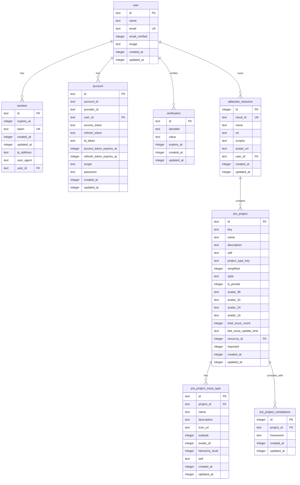

# Database ER Diagram

```mermaid
erDiagram
    user {
        text id PK
        text name
        text email UK
        integer email_verified
        text image
        integer created_at
        integer updated_at
    }

    session {
        text id PK
        integer expires_at
        text token UK
        integer created_at
        integer updated_at
        text ip_address
        text user_agent
        text user_id FK
    }

    account {
        text id PK
        text account_id
        text provider_id
        text user_id FK
        text access_token
        text refresh_token
        text id_token
        integer access_token_expires_at
        integer refresh_token_expires_at
        text scope
        text password
        integer created_at
        integer updated_at
    }

    verification {
        text id PK
        text identifier
        text value
        integer expires_at
        integer created_at
        integer updated_at
    }

    atlassian_resource {
        integer id PK
        text cloud_id UK
        text name
        text url
        text scopes
        text avatar_url
        text user_id FK
        integer created_at
        integer updated_at
    }

    jira_project {
        text id PK
        text key
        text name
        text description
        text self
        text project_type_key
        integer simplified
        text style
        integer is_private
        text avatar_48
        text avatar_32
        text avatar_24
        text avatar_16
        integer total_issue_count
        text last_issue_update_time
        integer resource_id FK
        integer imported
        integer created_at
        integer updated_at
    }

    jira_project_issue_type {
        text id PK
        text project_id FK
        text name
        text description
        text icon_url
        integer subtask
        integer avatar_id
        integer hierarchy_level
        text self
        integer created_at
        integer updated_at
    }

    jira_project_compliance {
        integer id PK
        text project_id FK
        text framework
        integer created_at
        integer updated_at
    }

    user ||--o{ session : "has"
    user ||--o{ account : "has"
    user ||--o{ atlassian_resource : "owns"
    user ||--o{ verification : "verifies"
    atlassian_resource ||--o{ jira_project : "contains"
    jira_project ||--o{ jira_project_issue_type : "has"
    jira_project ||--o{ jira_project_compliance : "complies_with"
```
